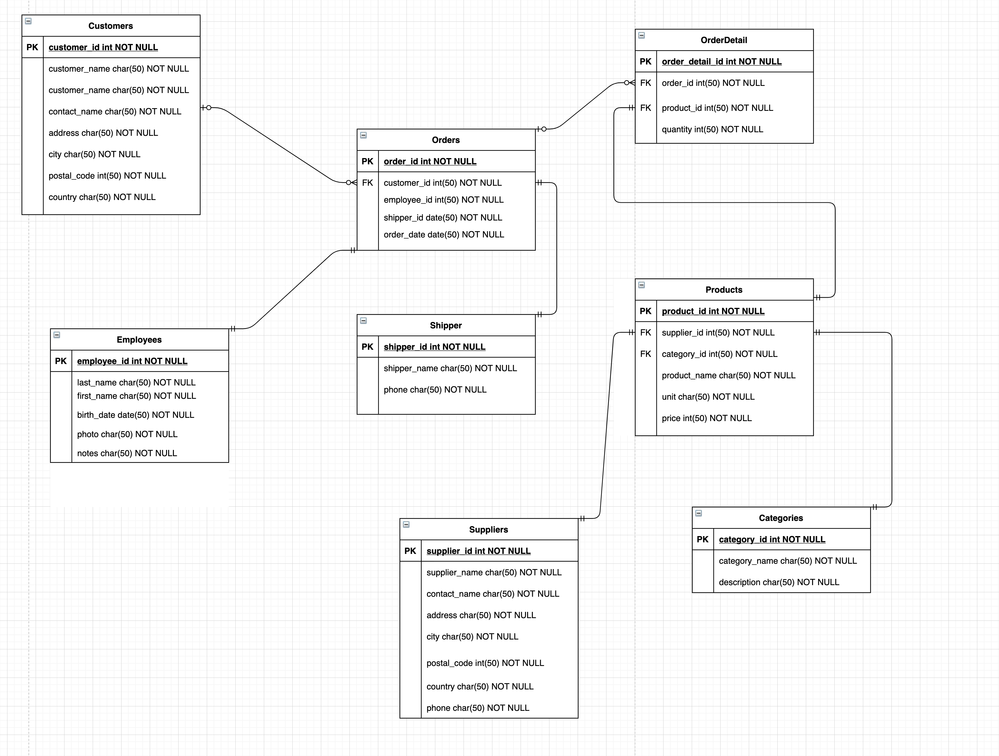

# Basic SQL Examples

DATABASE ERD:



### 1.- Basic DB Commands

* Create a Table
```sql
CREATE TABLE usuarios ( id INTEGER PRIMARY KEY AUTOINCREMENT, name VARCHAR(20), description TEXT )
```

* Rename a table
```sql
ALTER TABLE usuarios RENAME TO users
```

* Delete a table
```sql
DROP TABLE usuarios
```

* Rename a column
```sql
ALTER TABLE users RENAME COLUMN name TO username
```

* Add a new column
```sql
ALTER TABLE users ADD COLUMN age
```

* Remove a column
```sql
ALTER TABLE users DROP COLUMN age
```

----

### 2.- Insert/Update/Delete Data

* Inserting data
```sql
INSERT INTO users (name, description) VALUES ('Christofer','Web Dev');
```

* Updating data
```sql
UPDATE users SET name = 'testing update' # All Rows will be affected

UPDATE users SET name = 'just one' WHERE id = 1 # Filtered condition
```

* Delete data
```sql
DELETE FROM users WHERE id = 1
```

### 3.- Basic querys

* no filter
```sql
SELECT * FROM Customers
```

* filtered info
```sql
SELECT * FROM Customers WHERE Country = "Mexico"
```
```sql
SELECT * FROM Products WHERE price BETWEEN 50 AND 200
```
```sql
SELECT * FROM Customers WHERE city IN ("Berlin", "London")
```
```sql
SELECT * FROM Customers WHERE ContactName LIKE '%Mar%'
```

* Ordered info
```sql
SELECT * FROM Customers ORDER BY customerID
```

* Paginated query
```sql
SELECT * FROM Customers LIMIT 5
```

* Offset paginated query
```sql
SELECT * FROM Customer LIMIT 5 OFFSET 5
```

----

### 4.- Aggregate functions
* Count the rows
```sql
SELECT COUNT(customerID) FROM Customers
```

* Sum rows
```sql
SELECT SUM(price) from Products
```

----

### 5.- Relationships

* Basic `one-to-many` query
```sql
SELECT *, o.orderDate FROM Customers as c
INNER JOIN orders as o
WHERE c.customerID = o.customerID
```

* Nested querys
```sql
SELECT *, sh.shipperName FROM Customers as c
INNER JOIN orders as o
ON c.customerID = o.customerID
INNER JOIN shippers as sh
ON o.shipperID = sh.shipperID
```


